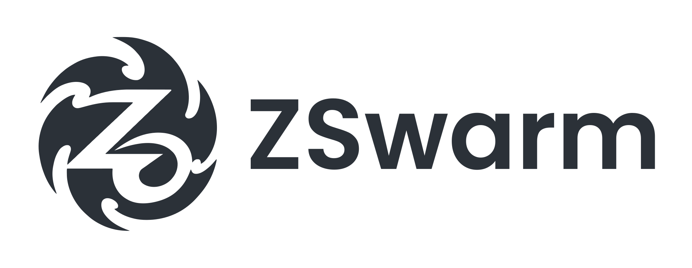
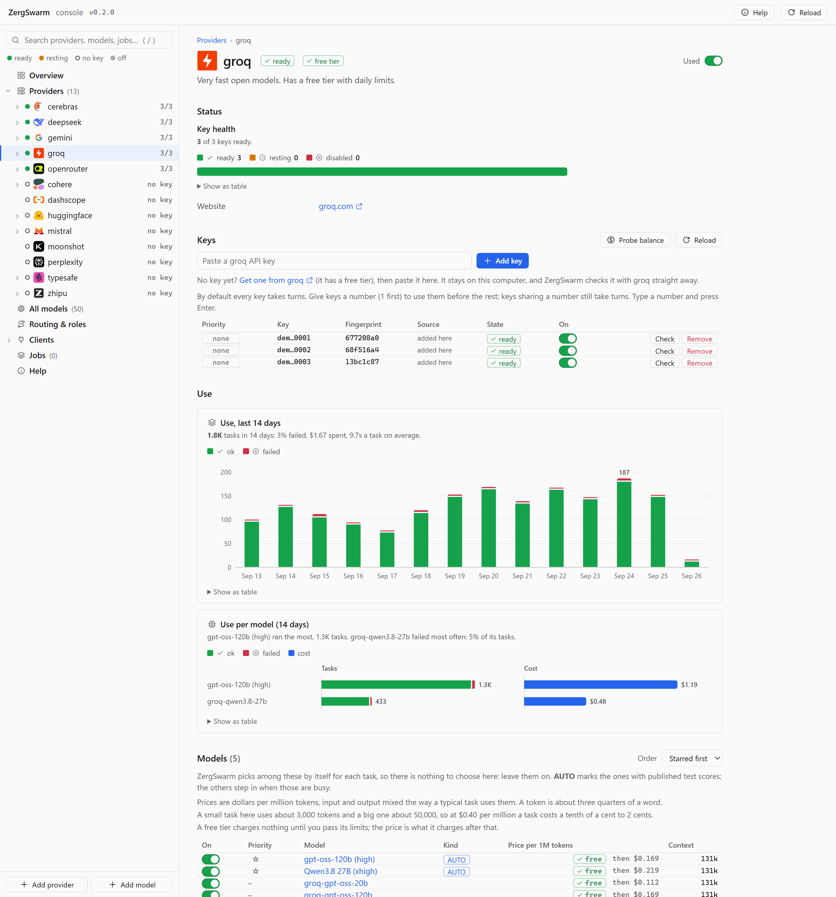
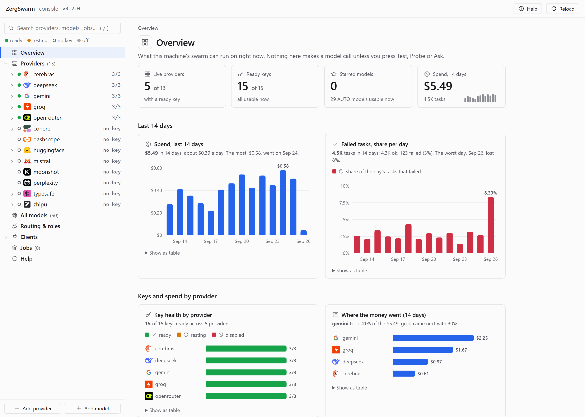
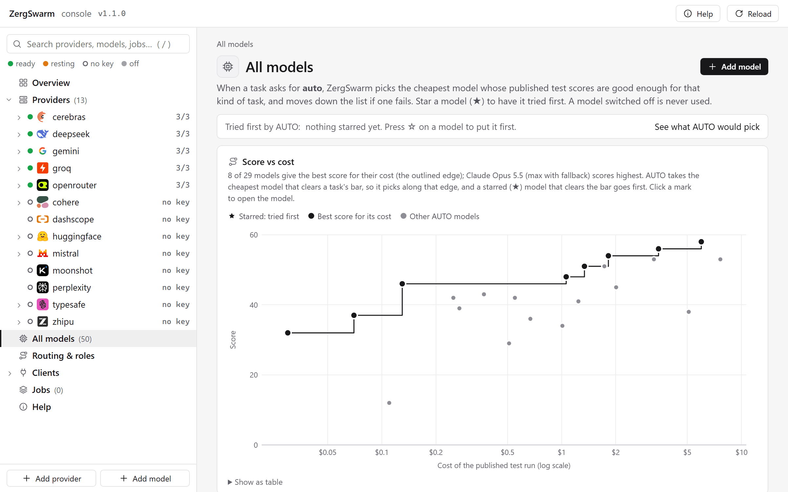

<div align="center">

<picture>
  <source media="(prefers-color-scheme: dark)" srcset="docs/img/logo-dark.svg">
  
</picture>

<br/>
<br/>

<strong>Hand your coding agent a swarm.</strong><br/>
Claude Code, Claude Desktop and Codex send the busywork to dozens of cheap AI models at once, and get the answers back as data.

<br/>
<br/>

[](https://github.com/Lunarwerx/ZergSwarm/releases/latest)
[](https://github.com/Lunarwerx/ZergSwarm/actions/workflows/ci.yml)
[](https://www.python.org/downloads/)
[](https://modelcontextprotocol.io)
[](LICENSE)
[](https://discord.gg/PsWpeNUzhk)

<br/>
<br/>

<a href="https://github.com/Lunarwerx/ZergSwarm">
  <picture>
    <source media="(prefers-color-scheme: dark)" srcset="docs/img/console-provider-dark.png">
    
  </picture>
</a>

</div>

---

Your main agent is expensive and does one thing at a time. Most of what it spends its day on is wide and
repetitive: read sixty files and report on each, check every call site, summarize every log, grade every answer.

**ZergSwarm** takes that part. It is an MCP server, a CLI and a local web console. Your agent hands it a batch of
tasks; it runs them all at once on the cheapest models that are good enough for the job (Gemini, Groq, Cerebras,
DeepSeek, OpenRouter, Mistral, Hugging Face, or any OpenAI-compatible endpoint), and hands back each answer,
checked against the JSON schema you asked for. Your agent stays the one that plans, decides and verifies.

```bash
irm https://raw.githubusercontent.com/Lunarwerx/ZergSwarm/main/install.ps1 | iex        # Windows (PowerShell)
curl -fsSL https://raw.githubusercontent.com/Lunarwerx/ZergSwarm/main/install.sh | sh     # macOS and Linux
# then, in a NEW terminal:
zswarm install        # connect it to Claude Code
zswarm ui             # open the console and paste a free API key
```

## ✨ At a glance

| | |
| --- | --- |
| **Many workers, one call** | `zswarm_run` takes a list of tasks, each with its own folder, tool set and optional JSON schema, and runs them concurrently. |
| **It picks the model** | Leave the model on `auto`: each task gets the cheapest configured model whose published test scores meet its bar. |
| **Starts on a free key** | Gemini, Groq, Cerebras and Mistral all have free tiers. Paste one key and it works. |
| **Keys that look after themselves** | A rate-limited key rests, a key out of credit is set aside, a key the provider refuses is never kept. When a provider runs dry, tasks move to the next capable model instead of stopping. |
| **Every call costed** | Each task records its model, time and price. The console charts spend per day, per provider and per model. A daily cap stops new work once it is reached. |
| **Workers get only what you allow** | Each task names its tools: `none`, `read`, `edit` (files inside its folder) or `all` (adds a shell). |
| **One console for all of it** | `zswarm ui`: keys, providers, models, priorities, roles, jobs and client setup, in light or dark. |

## 📦 Install

Needs **Python 3.11 or newer**. Each installer puts the `zswarm` command on your PATH through
[pipx](https://pipx.pypa.io), in its own environment, from the latest release.

**Windows** (PowerShell)

```powershell
irm https://raw.githubusercontent.com/Lunarwerx/ZergSwarm/main/install.ps1 | iex
```

**macOS and Linux**

```bash
curl -fsSL https://raw.githubusercontent.com/Lunarwerx/ZergSwarm/main/install.sh | sh
```

**With pip or pipx directly**

```bash
pipx install "git+https://github.com/Lunarwerx/ZergSwarm"      # or: pip install "git+https://..."
```

Every [release](https://github.com/Lunarwerx/ZergSwarm/releases) also carries the wheel and the source archive,
if you would rather download and install a file (`pipx install zergswarm-<version>-py3-none-any.whl`).

Open a new terminal afterwards so it sees the `zswarm` command, then check it: `zswarm --version`.

## 🚀 Quick start

1. **Connect your agent.** `zswarm install` registers the MCP server with Claude Code. Add
   `--client all` for Claude Desktop and Codex too, and `--instructions` to add a short "when to use the swarm"
   note to `~/.claude/CLAUDE.md` and `~/.codex/AGENTS.md`. The console's **Clients** page does the same in one
   click.
2. **Add a key.** `zswarm ui` opens the console at `http://127.0.0.1:7790/ui`. Pick a provider, follow its
   *Get a key* link, and paste the key on its page. ZergSwarm checks it with the provider straight away and keeps
   it only if it works. From the terminal: `zswarm keys add gemini` (it asks for the key, hidden, and checks it the
   same way).
3. **Ask your agent to use it**, in a new chat:
   > *"Use zswarm to read every file under src/ and list the functions that do network I/O."*

`zswarm doctor` says what is ready: keys, models, binaries.

## 🖥️ The console

A tree of everything on the left, the selected item on the right. Each provider opens onto its models; each
provider and model page charts its own use.

<table>
<tr>
<td width="50%"><picture><source media="(prefers-color-scheme: dark)" srcset="docs/img/console-overview-dark.png"></picture><br/><sub><b>Overview.</b> What can run right now, and what the last two weeks cost.</sub></td>
<td width="50%"><picture><source media="(prefers-color-scheme: dark)" srcset="docs/img/console-models-dark.png"></picture><br/><sub><b>All models.</b> Published test score against cost: the edge AUTO picks along.</sub></td>
</tr>
</table>

Every button in it is a JSON call you can make yourself: [docs/API.md](docs/API.md).

## 🧠 How it picks a model

`zswarm/data/published-models.json` holds published benchmark results. Every model whose provider file names a
`benchmark_slug` takes part in AUTO. For each task, AUTO:

1. keeps the configurations that meet every score floor of the task's **profile** (`general`, `code`,
   `decision`, `research`, `critical`, `routine`),
2. drops those whose provider has no ready key,
3. puts your starred models first (star a model in the console, or give it a `priority`),
4. orders the rest by what the published test run cost, cheapest first.

If a provider runs out mid-task, the task carries on with the next configuration, its finished tool calls kept.
Preview the choice without a model call: `zswarm_select`, or **Routing & roles › Preview AUTO** in the console.
Details: [docs/RUNTIME-SELECTION.md](docs/RUNTIME-SELECTION.md).

## 🧰 Tools your agent gets

| tool | what it does |
| --- | --- |
| `zswarm_run` | a batch of tasks, run concurrently; each answer comes back, plus `data` when a schema was given |
| `zswarm_ask` | one tool-free question: classify, summarize, rewrite, a second opinion |
| `zswarm_status` · `zswarm_results` · `zswarm_cancel` · `zswarm_jobs` | follow a long batch started with `wait: false` |
| `zswarm_select` | which models AUTO would use right now, without a model call |
| `zswarm_review` · `zswarm_panel` · `zswarm_doubt` | a reviewer roster over a diff, a blind multi-model panel, a fresh second look |
| `zswarm_decide` | typed decisions (pick one, yes or no, a score) answered in bulk |
| `zswarm_keys` · `zswarm_models` · `zswarm_doctor` · `zswarm_cost` | what is configured, ready and spent |

A task looks like this:

```json
{"id": "auth", "prompt": "List every place src/auth/ reads a token from the environment.",
 "cwd": "/abs/path/to/repo", "tools": "read",
 "schema": {"type": "object", "required": ["sites"], "properties": {"sites": {"type": "array", "items": {"type": "string"}}}}}
```

> [!TIP]
> Workers are cheap, not infallible. A finding that cites `file:line` should be checked at that line before
> anything depends on it.

## 🔑 Providers

Every provider is one TOML file in [zswarm/providers/](zswarm/providers/). Yours live in `~/.zswarm/providers/`
and change only what they say; a new file name is a new provider. The console writes these files for you and
keeps your comments.

| provider | free tier | notes |
| --- | :---: | --- |
| Gemini | ✅ | Google's models; the vision default |
| Groq | ✅ | very fast open models, daily limits |
| Cerebras | ✅ | very fast open models, daily limits |
| Mistral | ✅ | Mistral's own models |
| DeepSeek | | direct, and prices halve off-peak |
| OpenRouter | | one account, hundreds of models; a few are free |
| Hugging Face | | a router to many open models; a small free monthly credit |
| Cohere · Moonshot · DashScope · Zhipu · Perplexity | | paid per use |
| anything OpenAI-compatible | | Ollama, vLLM, LM Studio, Together, Azure, your own gateway: **+ Add provider** |

```toml
# ~/.zswarm/providers/ollama.toml: a local server as a provider
base_url = "http://127.0.0.1:11434/v1"
keys = ["ollama"]                    # a local server needs no key: any placeholder works

[models.llama-local]
api_id = "llama3.2"
ctx = 131072
price = { hit = 0, miss = 0, out = 0 }
```

<details>
<summary><b>Everything you can set, and where</b></summary>

| you want to | console | in the provider's file |
| --- | --- | --- |
| add a key | Providers › name: paste it | `keys = ["..."]`, or set `GROQ_API_KEY` (comma separated for several) |
| use some keys first | give them a priority number (1 first; the same number takes turns) | `key_priority = { "<fingerprint>" = 1 }` |
| park one key | its switch in the key table | kept in `~/.zswarm/keys.json` by fingerprint |
| cap what a day can cost | Routing & roles › Daily cap | `daily_cap_usd = 5` in `settings.toml` |
| stop using a provider, keep its keys | its switch | `enabled = false` |
| never use a model | the model's switch | `[models.<name>]` `enabled = false` |
| try some models first | the star, or a priority number | `[models.<name>]` `priority = 1` |
| point a role at a model | Routing & roles | `[roles]` `code = "<model>"` in `settings.toml` |
| add a model | + Add model | `[models.<name>]` with `api_id`, `ctx`, `price` |

Priority reorders; it never lowers the bar. A model you add yourself has no published scores, so reach it by
name, by a role, or through a route. A running server picks up file changes on its next call. The full field
list is in [docs/PROVIDERS.md](docs/PROVIDERS.md).

</details>

## ⌨️ Command line

| command | what it does |
| --- | --- |
| `zswarm ui` | open the console (starts the local server if it is not running) |
| `zswarm install` | register with Claude Code; `--client all` for Claude Desktop and Codex too |
| `zswarm keys add <provider>` | add a key, typed hidden; `zswarm keys` lists every pool |
| `zswarm doctor` | what is configured and ready |
| `zswarm ask "<question>"` | one tool-free question from the terminal |
| `zswarm run tasks.json` | run a batch from a file |
| `zswarm status` · `results` · `cancel` · `jobs` | follow and manage jobs |
| `zswarm cost` | what the ledger says was spent |
| `zswarm help` | every command, with whether it reads, writes or spends |

## 🔧 Build from source

```bash
git clone https://github.com/Lunarwerx/ZergSwarm
cd ZergSwarm
pip install -e ".[test]"       # an editable install with the test tools
pytest                         # the unit tests: offline, nothing touches your real ~/.zswarm
python -m build                # the wheel and source archive, into dist/ (pip install build first)
python scripts/console_dev.py  # the console against a scratch home, on port 7815
```

`python zswarm.py <command>` also runs straight from a clone once `httpx`, `jsonschema`, `mcp` and `tomlkit` are
installed. A release is a tag: push `v<version>` and [the release workflow](.github/workflows/release.yml) tests,
builds, installs the wheel on Windows, macOS and Linux, and publishes it. Layout and conventions for
contributors, human or agent, are in [AGENTS.md](AGENTS.md).

## 🔒 Security and privacy

- The server listens on `127.0.0.1` only, and refuses any request whose Host is not this machine, so a web page
  cannot drive it. API calls need the token in `~/.zswarm/console-token`. The console page opens without a login;
  on a machine other people share, set `ZSWARM_UI_SIGN_IN=1` for a one-time sign-in link instead.
- Keys you add live in plain text in `~/.zswarm/providers/<name>.toml` (owner-only on macOS and Linux), like most
  CLI tools' credentials. They are never logged, printed or returned: everything shows a fingerprint. Prefer
  environment variables? Leave `keys` out and set `<PROVIDER>_API_KEY`.
- Prompts, and the files a worker reads, go to the provider that serves the task. Switch off any provider you do
  not want your code sent to. A worker with `edit` changes files only inside its task's folder; `all` also gives
  it a shell, and shell commands are not limited to that folder. Give each task the narrowest set that does the job.

## ❓ FAQ

**What does it cost?**
ZergSwarm itself is free. You pay each provider directly, or nothing on a free tier. A small task here uses about
3,000 tokens and a big one about 50,000, so at $0.40 per million tokens a task costs a tenth of a cent to two
cents. Every task's cost is in the console, and a daily cap stops new work once it is reached.

**Which assistants does it work with?**
Claude Code (the CLI, the IDE extensions and the desktop app's Code tab), Claude Desktop, and Codex (CLI, IDE
extension and desktop app). Anything else can use the local HTTP API. Exact client configs and the timeouts that
matter are in [docs/CLIENTS.md](docs/CLIENTS.md).

**Do I have to pick models?**
No. Leave everything on `auto`. Star a model only if you want it tried first.

**Can it change my files?**
Only when a task asks for it. With `edit`, a worker changes files inside that task's folder and nowhere else. With
`all` it also gets a shell, and a shell command can reach anything your user account can, so use `all` only for
tasks that must run commands.

**Where does my data go?**
To the provider serving each task, and nowhere else. The console and the ledger stay on your machine.

## 📄 License

[MIT](LICENSE) © [LunarWerx](https://github.com/LunarWerxs)

Made by [LunarWerx Studios](https://lunarwerx.com). Check out sibling projects [AgentHydra](https://agenthydra.lunarwerx.com), [RepoYeti](https://repoyeti.com), [SageThumbs](https://sagethumbs.lunarwerx.com), and [QuickDictate](https://quickdictate.lunarwerx.com).

<div align="center">
<br/>
<sub><strong>ZergSwarm</strong>: the busywork, done wide.</sub>
</div>
